Breast cancer mini project edX
================
Mitja Prah
21 10 2020

## Breast Cancer Project - edX HarvardX

These are my solutions for the mini project in the course “Data Science:
Machine Learning - PH125.8x”. The brca dataset from dslabs package is
used, which contains information about breast cancer diagnosis biopsy
samples for tumors that were determined to be either benign and
malignant.

brca\_y\_element: a vector of sample classifications (“B” = benign or
“M” = malignant) brca\_x\_element: a matrix of numeric features
describing properties of the shape and size of cell nuclei extracted
from biopsy microscope images

Loading the data by setting options and loading the libraries:

``` r
options(digits = 3)
library(matrixStats)
library(tidyverse)
library(caret)
library(dslabs) #make sure this package is updated by typing: install.packages("dslabs")
data(brca)
```

### Ass18 Q1

``` r
str(brca) #check the structure of the database
```

    ## List of 2
    ##  $ x: num [1:569, 1:30] 13.5 13.1 9.5 13 8.2 ...
    ##   ..- attr(*, "dimnames")=List of 2
    ##   .. ..$ : NULL
    ##   .. ..$ : chr [1:30] "radius_mean" "texture_mean" "perimeter_mean" "area_mean" ...
    ##  $ y: Factor w/ 2 levels "B","M": 1 1 1 1 1 1 1 1 1 1 ...

``` r
dim(brca$x)[1] #determine the number of samples
```

    ## [1] 569

``` r
dim(brca$x)[2] #determine the number of features
```

    ## [1] 30

``` r
mean(brca$y == "M") #determine the proportion of malignant samples
```

    ## [1] 0.373

``` r
which.max(colMeans(brca$x)) #determine the column number with the highest mean
```

    ## area_worst 
    ##         24

``` r
which.min(colSds(brca$x)) #determine the column number with the lowest sd
```

    ## [1] 20

### Ass18 Q2

Define objects x and y for more concise coding:

``` r
x <- brca$x
y <- brca$y

scale1 <- sweep(x, 2, colMeans(x), FUN = "-")#scale each column by subtracting the column mean
class(scale1)
scale2 <- sweep(scale1, 2, colSds(scale1), FUN = "/") #rescale by dividing by the column SD.
```

``` r
sd(scale2[,1]) #determine SD of the 1st column
```

    ## [1] 1

``` r
median(scale2[,1]) #determine the median of the 1st column
```

    ## [1] -0.215

### Ass18 Q3

Calculate the distance between all SAMPLES using the scaled matrix (=
“scale2”):

``` r
dist3 <- dist(scale2)
dist3 <- as.matrix(dist3) #convert dist object into matrix
```

Define indices of benign and malignant samples, respectively:

``` r
ind_B <- which(y == "B")
ind_M <- which(y == "M")
```

Explore 1st 5 rows and columns to have a better picture of the matrix
symmetry:

``` r
as.matrix(dist3[ind_B,]) [1:5, 1:5] 
```

    ##      1    2    3    4    5
    ## 1 0.00 3.10 3.62 5.20 4.46
    ## 2 3.10 0.00 4.01 5.62 4.37
    ## 3 3.62 4.01 0.00 5.12 2.95
    ## 4 5.20 5.62 5.12 0.00 5.02
    ## 5 4.46 4.37 2.95 5.02 0.00

Note: 1st row equals the 1st column etc.

Determine average distances between 1st sample and other benign samples:

``` r
vektor_dist <- dist3[1,] #Only 1st row is extracted, since we're only interested in comparisons to the 1st sample
mean(vektor_dist[ind_B])
```

    ## [1] 4.4

Determine average distances between 1st sample and malignant samples:

``` r
mean(vektor_dist[ind_M])
```

    ## [1] 7.12

### Ass18 Q4

Make a heatmap of the relationship between FEATURES using the scaled
matrix. Since we are interested in relations between features, not
samples, we need to transpose the matrix of dist\!\!\! (see the
textbook, p627):

``` r
d_features <- dist(t(scale2))
Heatmap_features <- heatmap(as.matrix(d_features), labRow = NA, labCol = NA)
```

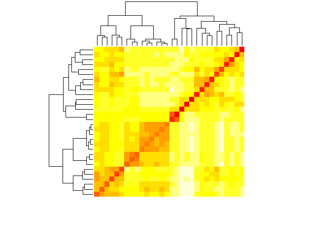<!-- -->

``` r
Heatmap_features
```

    ## $rowInd
    ##  [1]  7  8 28  6 27 26 14 13 11 24 23 21  4  3  1 22  2 12 19 15 20 18 16 17 30
    ## [26] 10  5 25  9 29
    ## 
    ## $colInd
    ##  [1]  7  8 28  6 27 26 14 13 11 24 23 21  4  3  1 22  2 12 19 15 20 18 16 17 30
    ## [26] 10  5 25  9 29
    ## 
    ## $Rowv
    ## NULL
    ## 
    ## $Colv
    ## NULL

Save this plot as the png file:

    ## png 
    ##   2

### Ass18 Q5

Perform hierarchical clustering and cluster dendrogram:

``` r
h <- hclust(d_features)
plot(h, cex = 0.65)
```

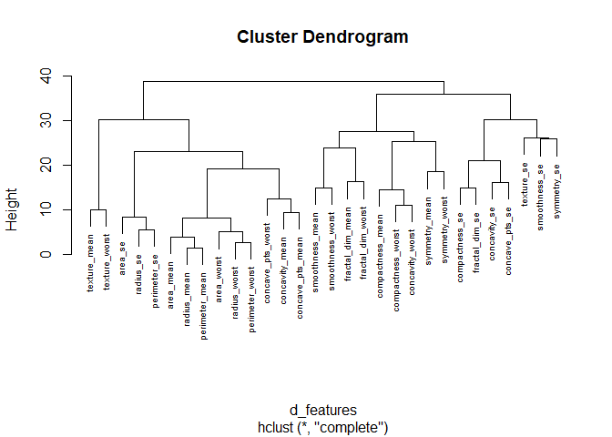<!-- -->

Save the cluster dendrogram as png file:

``` r
png(filename="Figs/Cluster_dendrogram_features.png")
plot(h, cex = 0.65)
dev.off()
```

Cut the tree into 5 groups (see the textbook, p679):

``` r
groups <- cutree(h, k = 5)
split(names(groups), groups)
```

    ## $`1`
    ##  [1] "radius_mean"       "perimeter_mean"    "area_mean"        
    ##  [4] "concavity_mean"    "concave_pts_mean"  "radius_se"        
    ##  [7] "perimeter_se"      "area_se"           "radius_worst"     
    ## [10] "perimeter_worst"   "area_worst"        "concave_pts_worst"
    ## 
    ## $`2`
    ## [1] "texture_mean"  "texture_worst"
    ## 
    ## $`3`
    ## [1] "smoothness_mean"   "compactness_mean"  "symmetry_mean"    
    ## [4] "fractal_dim_mean"  "smoothness_worst"  "compactness_worst"
    ## [7] "concavity_worst"   "symmetry_worst"    "fractal_dim_worst"
    ## 
    ## $`4`
    ## [1] "texture_se"    "smoothness_se" "symmetry_se"  
    ## 
    ## $`5`
    ## [1] "compactness_se" "concavity_se"   "concave_pts_se" "fractal_dim_se"

### Ass18 Q6

Perform a principal component analysis of the scaled matrix:

``` r
pca <- prcomp(scale2)
```

Determine the proportion of variance of PCA1; use summary (see the
textbook, p639):

``` r
summary(pca)
```

    ## Importance of components:
    ##                          PC1   PC2    PC3   PC4   PC5    PC6    PC7    PC8
    ## Standard deviation     3.644 2.386 1.6787 1.407 1.284 1.0988 0.8217 0.6904
    ## Proportion of Variance 0.443 0.190 0.0939 0.066 0.055 0.0403 0.0225 0.0159
    ## Cumulative Proportion  0.443 0.632 0.7264 0.792 0.847 0.8876 0.9101 0.9260
    ##                           PC9   PC10   PC11    PC12    PC13    PC14    PC15
    ## Standard deviation     0.6457 0.5922 0.5421 0.51104 0.49128 0.39624 0.30681
    ## Proportion of Variance 0.0139 0.0117 0.0098 0.00871 0.00805 0.00523 0.00314
    ## Cumulative Proportion  0.9399 0.9516 0.9614 0.97007 0.97812 0.98335 0.98649
    ##                           PC16    PC17    PC18    PC19    PC20  PC21    PC22
    ## Standard deviation     0.28260 0.24372 0.22939 0.22244 0.17652 0.173 0.16565
    ## Proportion of Variance 0.00266 0.00198 0.00175 0.00165 0.00104 0.001 0.00091
    ## Cumulative Proportion  0.98915 0.99113 0.99288 0.99453 0.99557 0.997 0.99749
    ##                           PC23   PC24    PC25    PC26    PC27    PC28    PC29
    ## Standard deviation     0.15602 0.1344 0.12442 0.09043 0.08307 0.03987 0.02736
    ## Proportion of Variance 0.00081 0.0006 0.00052 0.00027 0.00023 0.00005 0.00002
    ## Cumulative Proportion  0.99830 0.9989 0.99942 0.99969 0.99992 0.99997 1.00000
    ##                          PC30
    ## Standard deviation     0.0115
    ## Proportion of Variance 0.0000
    ## Cumulative Proportion  1.0000

### Ass18 Q7

Plot the first two principal components with color representing tumor
type B/M:

``` r
class(pca$x[,1:2]) #confirm that the class of the pca object is a matrix, which needs to be changed into dataframe before plotting:
```

    ## [1] "matrix"

``` r
data.frame(pca$x[,1:2], y) %>%
  ggplot(aes(PC1, PC2, col = y))+
  geom_point()
```

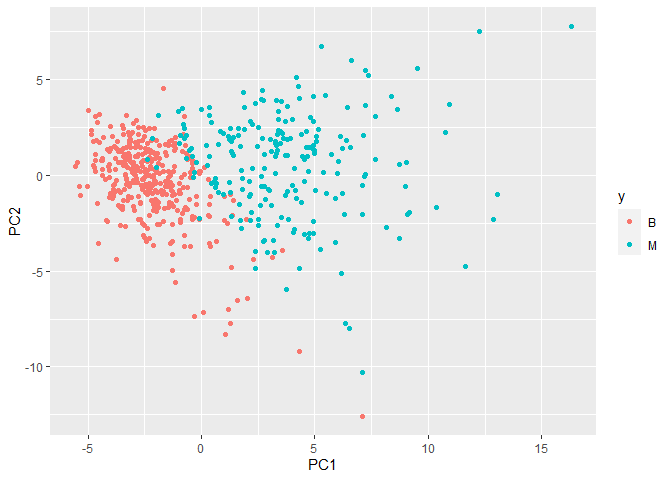<!-- -->

Save the ggplot as png file:

``` r
ggsave("Figs/PC2vsPC1_for_tumor_type.png")
```

### Ass18 Q8

Make a boxplot of the first 10 PCs grouped by tumor type. Solution with
a for loop, used in some other similar examples:

``` r
for(i in 1:10){
  boxplot(pca$x[,i] ~ y, main = paste("PC", i))
}
```

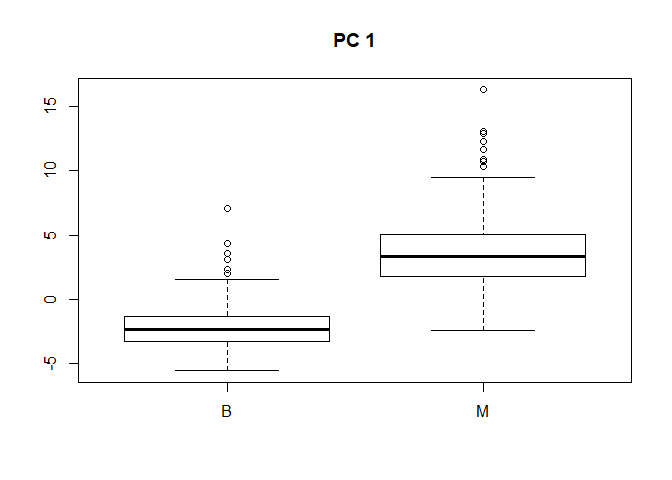<!-- -->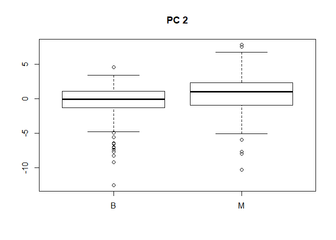<!-- -->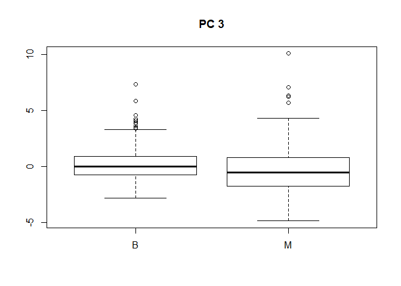<!-- -->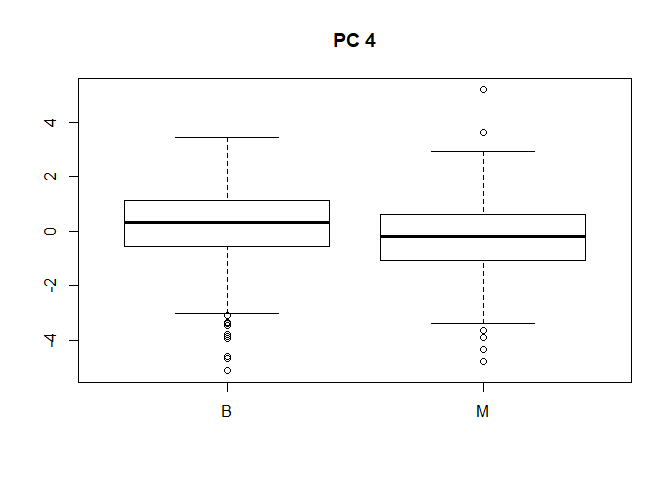<!-- -->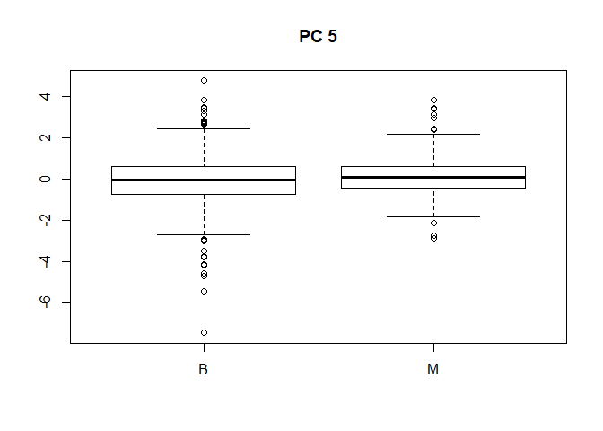<!-- -->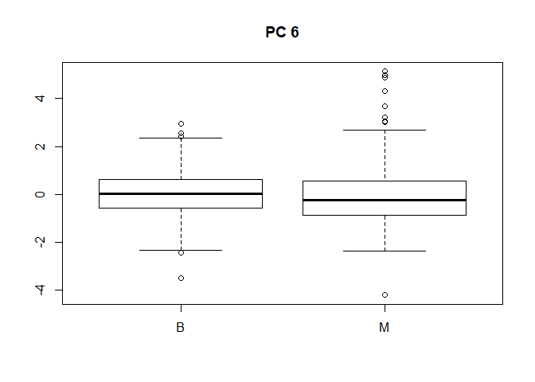<!-- -->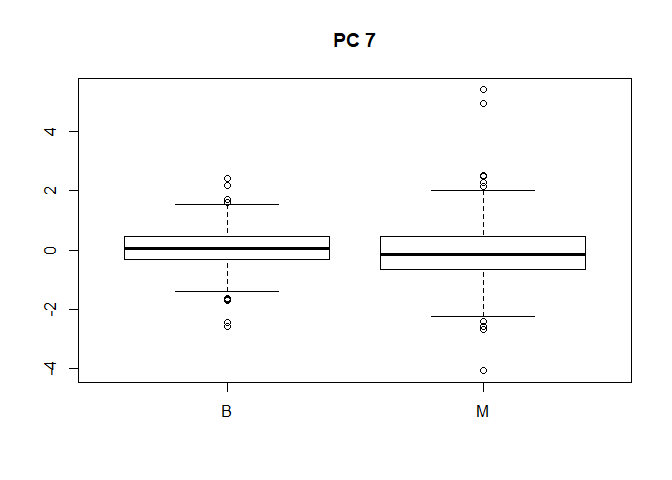<!-- -->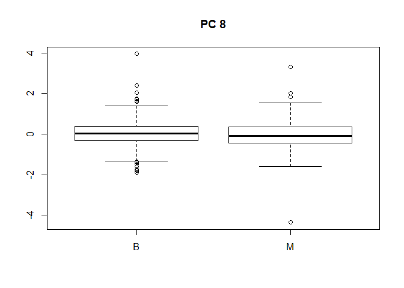<!-- -->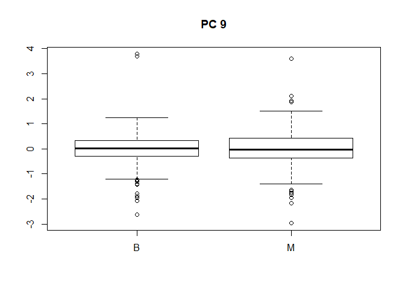<!-- -->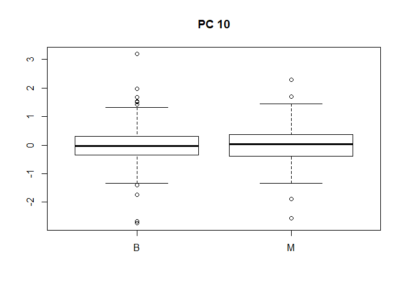<!-- -->

The downside is that each PC is plotted on a separate boxplot. Better
solution, which plots all the boxplots on the same figure:

``` r
data.frame(type = brca$y, pca$x[,1:10]) %>%
  gather(key = "PC", value = "value", -type) %>%
  ggplot(aes(PC, value, fill = type)) +
  geom_boxplot() 
```

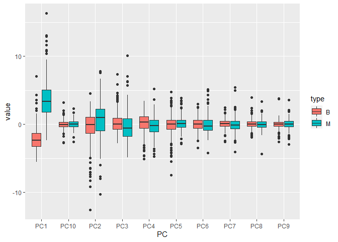<!-- -->

Save the ggplot as png file:

``` r
ggsave("Figs/Boxplot_10PCs_by_tumor_type.png")
```

### Ass18 Q9

Rename scale2 to follow the following example in the edX course

``` r
x_scaled <- scale2
```

Set the seed to 1, then create a data partition splitting
brca\_y\_column and the scaled version of the brca\_x\_column matrix
into a 20% test set and 80% train:

``` r
set.seed(1) # if using R 3.5 or earlier
#set.seed(1, sample.kind = "Rounding")    # if using R 3.6 or later
test_index <- createDataPartition(brca$y, times = 1, p = 0.2, list = FALSE)
test_x <- x_scaled[test_index,]
test_y <- brca$y[test_index]
train_x <- x_scaled[-test_index,]
train_y <- brca$y[-test_index]
```

Determine the training set proportion of benign tumors:

``` r
train <- data.frame(train_x, type = train_y)
mean(train$type == "B")
```

    ## [1] 0.628

Determine the test set proportion of benign tumors:

``` r
test <- data.frame(test_x, type = test_y)
mean(test$type == "B")
```

    ## [1] 0.626

Save test and train datasets as files:

``` r
save(train, file = "rData/TrainDataset.rda")
save(test, file = "rData/TestDataset.rda")
```

### Ass18 Q10a

Function predict\_kmeans() is predefined in the course. It takes two
arguments - a matrix of observations x and a k-means object k and
assigns each row of x to a cluster from k.

``` r
predict_kmeans <- function(x, k) {
    centers <- k$centers    # extract cluster centers
    # calculate distance to cluster centers
    distances <- sapply(1:nrow(x), function(i){
      apply(centers, 1, function(y) dist(rbind(x[i,], y)))
    })
    max.col(-t(distances))  # select cluster with min distance to center
  }
```

Setting the seed to 3:

``` r
set.seed(3)
```

Perform k-means clustering (textbook, p681) on the training set with 2
centers and assign the output to k:

``` r
k <- kmeans(train_x, centers = 2)
```

Use the predict\_kmeans() to make predictions on the test set:

``` r
kmeans_preds <- predict_kmeans(test_x, k)
```

Change numerical output (1,2) into characters (B, M):

``` r
kmeans_preds_char <- ifelse(kmeans_preds == 1, "B", "M")
```

Calculate the overall accuracy:

``` r
mean(kmeans_preds_char == test_y)
```

    ## [1] 0.922

### Ass18 Q10b

Determine the proportion of benign tumors correctly identified:

``` r
test_y_char <- as.character(test_y)
df_char <- as.data.frame(cbind(KMf = kmeans_preds_char, Yf = test_y_char))
all_YBs <- df_char %>% mutate(matches = KMf == Yf) %>% filter(Yf == "B")
mean(all_YBs$matches)
```

    ## [1] 0.986

The same with the use of sensitivity() function:

``` r
sensitivity(factor(kmeans_preds_char), test_y, positive = "B")
```

    ## [1] 0.986

Determine the proportion of malignant tumors correctly identified:

``` r
all_YMs <- df_char %>% mutate(matches = KMf == Yf) %>% filter(Yf == "M")
mean(all_YMs$matches)
```

    ## [1] 0.814

The same with the use of sensitivity() function:

``` r
sensitivity(factor(kmeans_preds_char), test_y, positive = "M")
```

    ## [1] 0.814

### Ass18 Q11

Fit a logistic regression model on the training set using all
predictors.

``` r
fit_glm <- train(train_x, train_y, method = "glm")
```

Obtain predictors and accuracy:

``` r
y_hat_glm <- predict(fit_glm, test_x)
confusionMatrix(data = y_hat_glm, reference = test_y)$overall["Accuracy"]
```

    ## Accuracy 
    ##    0.957

### Ass18 Q12

Train an LDA model on the training set and make predictions:

``` r
fit_lda <- train(train_x, train_y, method = "lda")
y_hat_lda <- predict(fit_lda, test_x)
confusionMatrix(data = y_hat_lda, reference = test_y)$overall["Accuracy"]
```

    ## Accuracy 
    ##    0.991

Train an QDA model on the training set and make predictions:

``` r
fit_qda <- train(train_x, train_y, method = "qda")
y_hat_qda <- predict(fit_qda, test_x)
confusionMatrix(data = y_hat_qda, reference = test_y)$overall["Accuracy"]
```

    ## Accuracy 
    ##    0.957

### Ass18 Q13

Load the gam package:

``` r
library(gam) 
```

Set the seed to 5

``` r
set.seed(5)
```

Fit a loess model on the training set, with default tuning:

``` r
fit_loess <- train(train_x, train_y, method = "gamLoess") #NOTE: ignore warnings.
```

Generate predictions:

``` r
y_hat_loess <- predict(fit_loess, test_x)
```

``` r
confusionMatrix(data = y_hat_loess, reference = test_y)$overall["Accuracy"]
```

    ## Accuracy 
    ##    0.983

### Ass18 Q14

Train a k-nearest neighbors model on the training set, with odd values
of k from 3 to 21.

``` r
k <- seq(3,21,2)
set.seed(7) #Set the seed to 7
fit_knn <- train(train_x, train_y, method = "knn", tuneGrid = data.frame(k = k))
```

Determine which is the final k value used in the model:

``` r
fit_knn$bestTune
```

    ##     k
    ## 10 21

A plot that shows the accuracy of the model based on different k values:

``` r
plot(fit_knn)
```

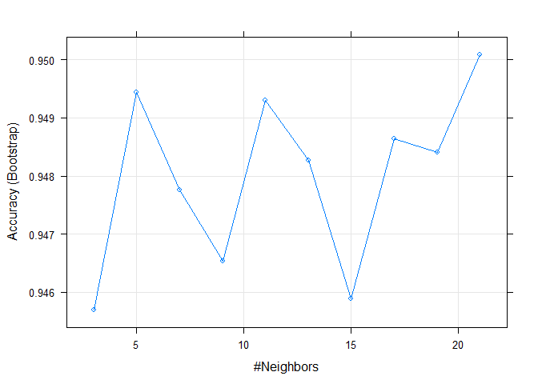<!-- -->

Generate predictions:

``` r
y_hat_knn <- predict(fit_knn, test_x)
confusionMatrix(data = y_hat_knn, reference = test_y)$overall["Accuracy"]
```

    ## Accuracy 
    ##    0.948

### Ass18 Q15

Train a random forest model on the training set, with mtry values of 3,
5, 7 and 9. Also, use the argument importance = TRUE so that feature
importance can be extracted.

``` r
set.seed(9) #Set the seed to 9
fit_rf <- train(train_x, train_y, method = "rf",tuneGrid = data.frame(mtry = c(3,5,7,9)), importance = TRUE)
```

Generate predictions:

``` r
y_hat_rf <- predict(fit_rf, test_x)
fit_rf$bestTune #Determine the best mtry value used in the model
```

    ##   mtry
    ## 1    3

``` r
plot(fit_rf) #A plot that shows the accuracy of the model based on different mtry values:
```

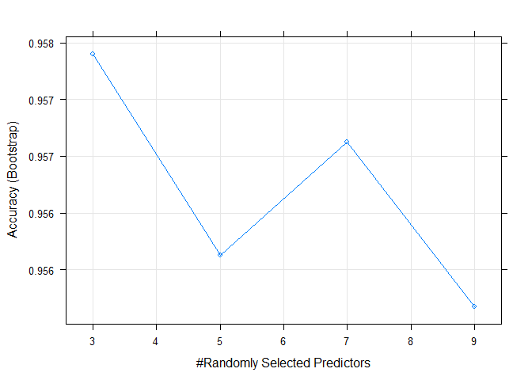<!-- -->

``` r
confusionMatrix(data = y_hat_rf, reference = test_y)$overall["Accuracy"] #overall accuracy
```

    ## Accuracy 
    ##    0.983

Determine the most important variable in the random forest model:

``` r
varImp(fit_rf)
```

    ## rf variable importance
    ## 
    ##   only 20 most important variables shown (out of 30)
    ## 
    ##                   Importance
    ## area_worst             100.0
    ## perimeter_worst         90.8
    ## concave_pts_worst       85.2
    ## radius_worst            82.8
    ## concave_pts_mean        71.4
    ## area_se                 64.7
    ## concavity_mean          63.5
    ## concavity_worst         63.2
    ## texture_worst           61.2
    ## area_mean               59.1
    ## texture_mean            55.9
    ## perimeter_mean          54.3
    ## smoothness_worst        50.5
    ## perimeter_se            50.2
    ## radius_mean             49.8
    ## radius_se               47.6
    ## symmetry_worst          45.1
    ## compactness_worst       43.6
    ## compactness_mean        31.8
    ## smoothness_mean         28.1

### Ass18 Q16a

We want to create an ensemble (the average of predictions) using the
predictions from all models, except k-means. First, we create a matrix
with all predictions:

``` r
matrix_ensemble <- cbind(y_hat_glm, y_hat_lda, y_hat_qda, y_hat_loess, y_hat_knn, y_hat_rf)

row_avg <- rowMeans(matrix_ensemble) #calculate row means
```

Create the ensemble prediction by a logical expression from the row
means (if most models suggest the tumor is malignant, predict
malignant):

``` r
y_hat_ensemble <- ifelse(row_avg <= 1.5, "B", "M")
```

Determining the accuracy of the ensemble predictions:

``` r
confusionMatrix(data = as.factor(y_hat_ensemble), reference = test_y)$overall["Accuracy"]
```

    ## Accuracy 
    ##    0.983

### Ass18 Q16b

Let’s make a table of all the accuracies, incl. k\_means:

``` r
kmeans_preds_fact <- factor(kmeans_preds_char)
models <- c("K-means", "Logistic regression", "LDA", "QDA", "Loess", "KNN", "Random forest", "Ensemble")
all_acc <- c(mean(kmeans_preds_fact == test_y),
             mean(y_hat_glm == test_y),
             mean(y_hat_lda == test_y),
             mean(y_hat_qda == test_y),
             mean(y_hat_loess == test_y),
             mean(y_hat_knn == test_y),
             mean(y_hat_rf == test_y),
             mean(as.factor(y_hat_ensemble) == test_y))
data.frame(Model = models, Accuracy = all_acc) %>% arrange(desc(Accuracy))
```

    ##                 Model Accuracy
    ## 1                 LDA    0.991
    ## 2               Loess    0.983
    ## 3       Random forest    0.983
    ## 4            Ensemble    0.983
    ## 5 Logistic regression    0.957
    ## 6                 QDA    0.957
    ## 7                 KNN    0.948
    ## 8             K-means    0.922

## Conclusion

Amongst the tested models, the LDA model yields the highest accuracy in
predicting the benign or malignant nature of breast tumors. Its
accuracy, based on our given database, is 99.1 %.
